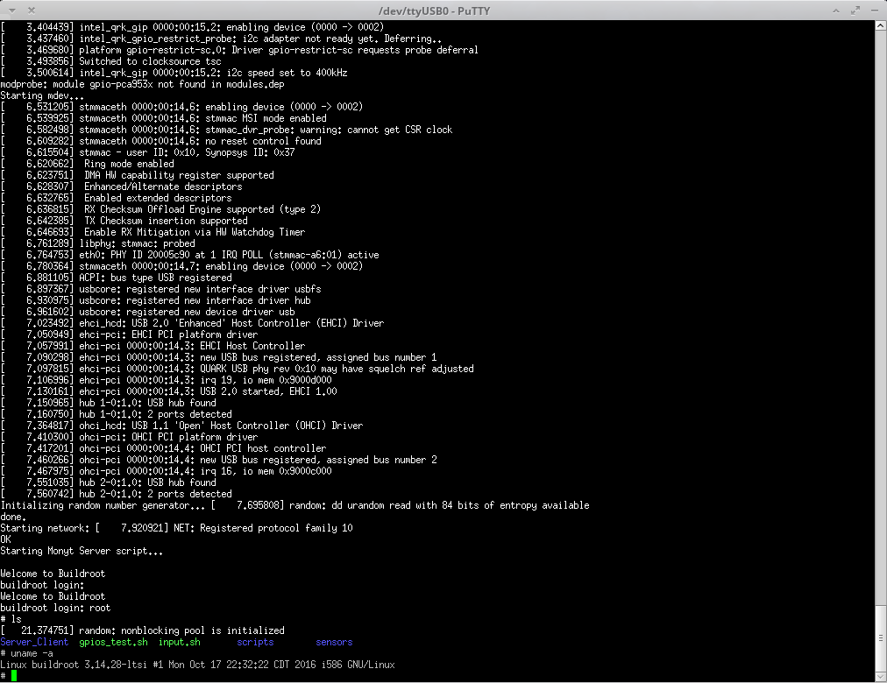
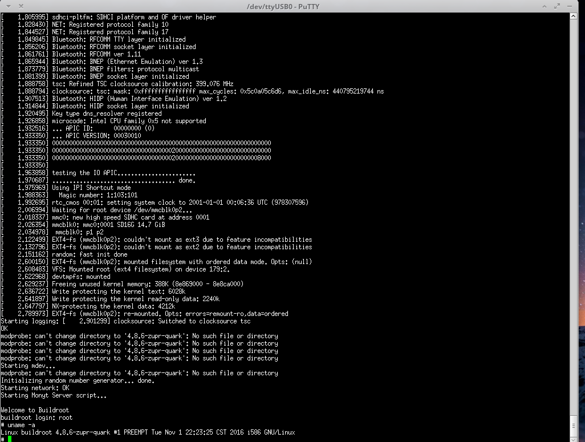

# Cross Compiling the kernel for the Intel Galileo board

I create and test a new kernel compiling it for the Intel Galileo Gen 2
board. To achieve this I use the tool crosstool, I would have liked do not
use any tool, but for time constrains I had to.

To get the cross compiling tool I had to configure crosstool to download
all the necessary tools to compile on the architecture i586, this is one
used by Intel Galileo.

To set the cross compiler toolchain on the kernel I had to add the toolchain
prefix on one configuration, the rest was left by the default options, I just
removed some unnecessary options like support for AMD, wireless modules, etc.

During the compilation I had problems with the certificates so I comment this
line `CONFIG_SYSTEM_TRUSTED_KEY` and other.


The only step I did to generate the static kernel image (bzImage), was:

```
make bzImage modules -j4
```

To only generate the bzImage with modules and use 4 processors to do the
compiling process.

Once the compiling process has finished the kernel image is stored in this
location `arch/x86/boot/`.

To test the instalation of the new image I just copied the bzImage generated
to `/boot/` on the file system. With just that I did not have to update the
parameters passed to the kernel.

I add two images showing the old and the new kernel.




	This is the kernel generated with buildroot. (The one used on the proyect)




	This is the new kernel generated.


The configuration file used on the compiling process is `kernel.config` and can be
found in the config folder.

