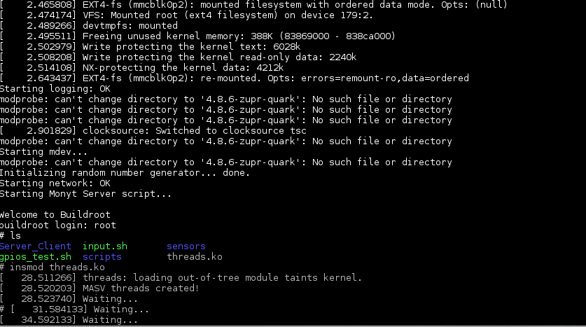
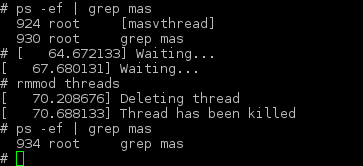

# Mi simple hilo de kernel

Para esta tarea se creo un hilo del kernel que imprime en pantalla cuando
este esta en ejecucion.

El hilo de kernel fue probado en una Intel galileo Gen 2 con el kernel de
`linux 4.8.6` que se compilo en la tarea anterior. 

El codigo del hilo creado se encuentra en `threads.c`

Para poder compilar el modulo de kernel basta con ejecutar:

```bash
make ARCH=i386 CROSS_COMPILE=i586-unknown-linux-gnu-
```

aunque en el archivo `Makefile` se necesitan las fuentes del kernel compilado,
en este caso el archivo Makefile tiene esa direccion en duro en una variable.

Se agregan 2 imagenes para mostrar cuando se carga el modulo y se descarga.




	Carga del sistema y carga del modulo de kernel usando `ismod`




	salida de `ps -ef` y descarga del modulo usando `rmmod`


