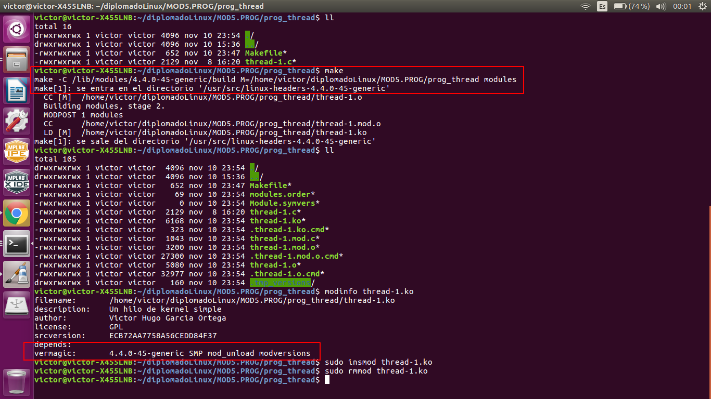
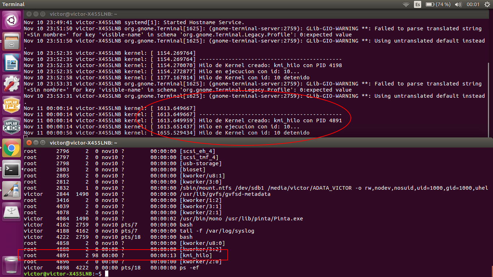
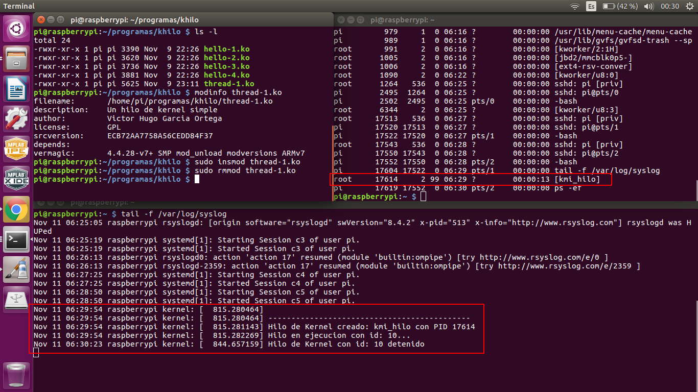

# Tarea 2: Creación de un hilo de kernel

## Programa del hilo en lenguaje C
El programa es realizado en lenguaje C. Se tienen básicamente tres funciones:

1. static int __init kernel_init(void)
Esta función crea el hilo mediante la funcion kthread_run. Esta función es ejecutada
cuando insertamos el módulo en el kernel mediante: *sudo insmod thread-1.ko*

2. static void __exit kernel_exit(void)
Esta función detiene la ejecución del hilo mediante la función kthread_stop(). Esta función
es ejecutada cuando retiramos el módulo del kernel  mediante: *sudo rmmod thread-1.ko*.
Esta función manda true a la función kthread_should_stop() que se encuentra en el hilo para
que el hilo termine.

3. int hilo_kernel(void *data)
Esta función ejecuta la funcionalidad del hilo. La ejecución del hilo se realiza mientras no 
se llame a la función kthread_stop(). Como parte del código de ejecución se llama a la 
función schedule(), la cual asigna al planificador el control del hilo.

Para realizar este código se tomó como referencias los siguientes enlaces:
[The Linux Kernel Module Programming Guide](http://www.tldp.org/LDP/lkmpg/2.6/html/index.html)
[kthreads, Florida State University](http://www.cs.fsu.edu/~cop4610t/lectures/project2/kthreads/kthreads.pdf)
[Kernel Thread implementation](http://stackoverflow.com/questions/5280693/kernel-thread-implementation)
 
y los libros:
**_Robert Love. Linux Kernel Development_**
**_Jonathan Corbet, et al. Linux Device Drivers_**

## Compilación con Makefile
Para realizar la compilación se uso los Makefiles proporcionados por el kernel de linux:

Para compilar el módulo de kernel en PC con Ubuntu:
# make -C /lib/modules/$(shell uname -r)/build M=$(PWD) modules

Para compilar el módulo de kernel con el compilador cruzado para la Raspberry PI 3:
# make ARCH=arm CROSS_COMPILE=arm-linux-gnueabihf- -C /home/victor/diplomadoLinux/linux M=$(PWD) modules

En ambos casos se genera el módulo thread-1.ko, los cuales se insertan en el kernel de Linux
usando el comando *sudo insmod thread-1.ko* y se retiran mediante *sudo rmmod thread-1.ko*

Para realizar la compilación se tomó como referencias los siguientes enlaces:
[The Linux Kernel Module Programming Guide](http://www.tldp.org/LDP/lkmpg/2.6/html/index.html)
[Compiling a kernel module for the raspberry pi 2](http://lostindetails.com/blog/post/Compiling-a-kernel-module-for-the-raspberry-pi-2)

## Pantallas de ejecución

En las siguientes pantallas se muestra la compilación, creación y ejecución del hilo de kernel para
la arquitectura X86_64 usando ubuntu.

En la . Se muestra la creación del módulo, así como la inserción y
el retiro del kernel.

En la . Se muestran los mensajes registrados en el archivo /var/log/syslog
cuando se inserta y se retira el módulo del kernel. Además se muestra la ejecución del hilo de kernel
mediante el comando ps -ef.

En las siguientes pantallas se muestra la compilación, creación y ejecución del hilo de kernel para
la arquitectura ARM usando Raspbian en Raspberry Pi 3.

En la . Se muestra la creación mediante compilación cruzada del módulo 
del hilo de kernel para ARM.

En la . Se muestra la inserción y retiro del hilo del kernel en Raspberry Pi 3,
asi como los mensajes registrados en el archivo /var/log/syslog y la ejecución del hilo de kernel
mediante el comando ps -ef.

