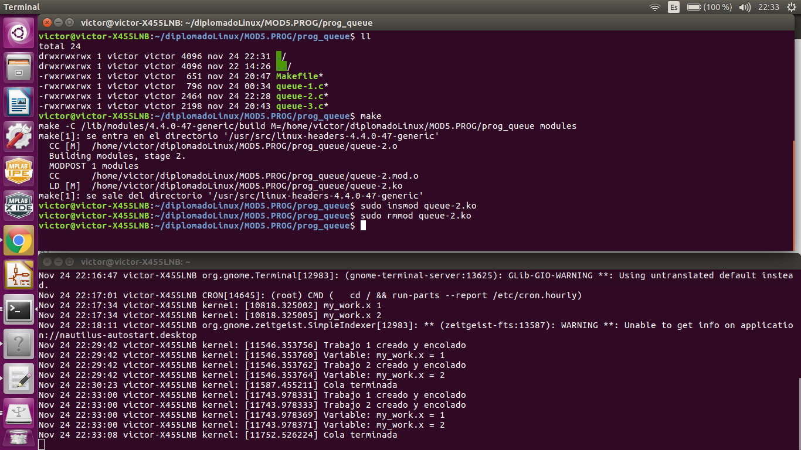
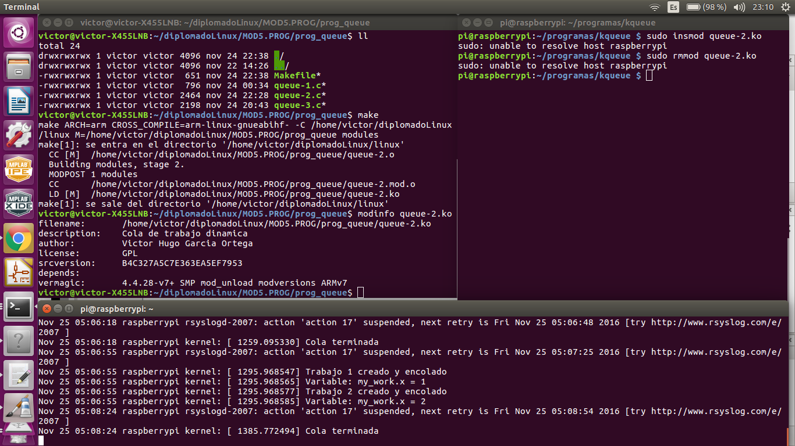

# Tarea 3: Creación de un cola de trabajo

## Programa del hilo en lenguaje C
El programa es realizado en lenguaje C. Se tienen básicamente tres funciones:

1. static int kernel_init(void)
Esta función crea la cola de trabajo mediante la funcion create_workqueue. Después crea dos
trabajos con la macro INIT_WORK y se encolan con la función queue_work. Estas funciónes son ejecutadas
cuando insertamos el módulo en el kernel mediante: *sudo insmod queue-2.ko*

2. static void kernel_exit(void)
Esta función verifica que los trabajos encolados se hayan ejecutado mediante la función flush_workqueue. 
También termina con la cola de trabajo mediante la función destroy_workqueue. Estas funciones son
ejecutadas cuando retiramos el módulo del kernel  mediante: *sudo rmmod thread-1.ko*.

3. static void my_wq_function( struct work_struct *work )
Esta función ejecuta la funcionalidad de los trabajos encolados. La función imprime una variable y termina.

Para realizar este código se tomó como referencias los siguientes enlaces:
[Linux World: Workqueue-3 using Runtime creation](http://tuxthink.blogspot.mx/2011/09/workqueue-3-using-runtime-creation.html)
[Kernel APIs, Part 2: Deferrable functions, kernel tasklets, and work queues](http://www.tldp.org/LDP/lkmpg/2.6/html/index.html)
 
y los libros:
**_Robert Love. Linux Kernel Development_**
**_Jonathan Corbet, et al. Linux Device Drivers_**

## Compilación con Makefile
Para realizar la compilación se uso los Makefiles proporcionados por el kernel de linux:

Para compilar el módulo de kernel en PC con Ubuntu:
# make -C /lib/modules/$(shell uname -r)/build M=$(PWD) modules

Para compilar el módulo de kernel con el compilador cruzado para la Raspberry PI 3:
# make ARCH=arm CROSS_COMPILE=arm-linux-gnueabihf- -C /home/victor/diplomadoLinux/linux M=$(PWD) modules

En ambos casos se genera el módulo queue-2.ko, los cuales se insertan en el kernel de Linux
usando el comando *sudo insmod queue-1.ko* y se retiran mediante *sudo rmmod queue-1.ko*

Para realizar la compilación se tomó como referencias los siguientes enlaces:
[The Linux Kernel Module Programming Guide](http://www.tldp.org/LDP/lkmpg/2.6/html/index.html)
[Compiling a kernel module for the raspberry pi 2](http://lostindetails.com/blog/post/Compiling-a-kernel-module-for-the-raspberry-pi-2)

## Pantallas de ejecución

En la siguiente pantalla se muestra la compilación, creación y ejecución de la cola de trabajo para
la arquitectura X86_64 usando ubuntu.

En la siguiente imagen: Se muestra la creación del módulo, así como la inserción y
el retiro del kernel. Se muestran los mensajes registrados en el archivo /var/log/syslog
cuando se inserta y se retira la cola de trabajo..

En la siguiente pantalla se muestra la compilación, creación y ejecución de la cola de trabajo para
la arquitectura ARM usando Raspbian en Raspberry Pi 3.

En la siguiente imagen se muestra la creación mediante compilación cruzada del módulo 
de la cola de trabajo para ARM. También se muestra la inserción y retiro en Raspberry Pi 3,
asi como los mensajes registrados en el archivo /var/log/syslog 

