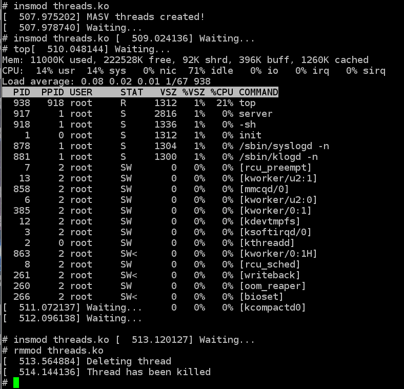

# Temporizadores

En esta tarea se compararon 2 temporizadores ssleep y mdelay 2 modulos de kernel
separados, cada modulo ejecuta un hilo con el correspondiente temporizador, y
se monitoreo de manera sencilla con el comando top.


Los ejemplos fueron probrados en una Intel galileo Gen 2 con el kernel de `linux 4.8.6`.

El codigo se encuentra en `threads.c` y `thr_mdelay.c`

Para poder compilar el modulo de kernel basta con ejecutar:

```bash
make ARCH=i386 CROSS_COMPILE=i586-unknown-linux-gnu-
```

Se agrega una imagen mostrando la carga y descarga del modulo y la salida del comando
top para comprobar los recursos de se estan consumiendo.




	Funcionamiento usando ssleep.


	Funcionamiento usando mdelay.


Como se observa en las imagenes, el consumo de recursos usando mdelay es por
mucho mayor al de ssleep, esto es debido a la implementacion de cada una.

Por lo que lei mdelay utiliza un loop mientras que ssleep cambia el estado
del proceso a `uninterruptible`

