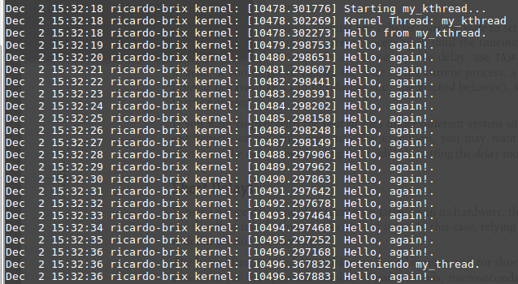

# Creación de un Hilo de Kernel

Se ha creado un hilo de kernel simple que imprime un hola mundo en la
bitácora del sistema. Posteriormente el hilo imprime un mensaje cada
segundo.

Resultados:

Se usaron las siguientes formas para demorar la ejecución:
                 
* while (time_before(...)) cpu_relax(): El hilo de kernel no
      hace caso del tiempo que se le da y al momento de ver la
      bitácora del sistema, no ve el tiempo de separación entre
      la impresión de cada mensaje.
                 
* while (time_before(...)) schedule(): No se imprimen los
      los mensajes de salida en la bitácora del sistema.
                 
* mdelay(...): Sí envía los mensajes a la bitácora en los
      tiempos deseados, pero detiene al procesador mientras no
      se está haciendo nada.
                 
* schedule_timeout(...): Colocando la tarea como
      TASK_INTERRUPTIBLE antes de llamar a schedule_timeout()
      el funcionamiento es el deseado, y el procesador no es
      interrumpido.
                 
Se muestra una imagen de la bitácora del sistema:

