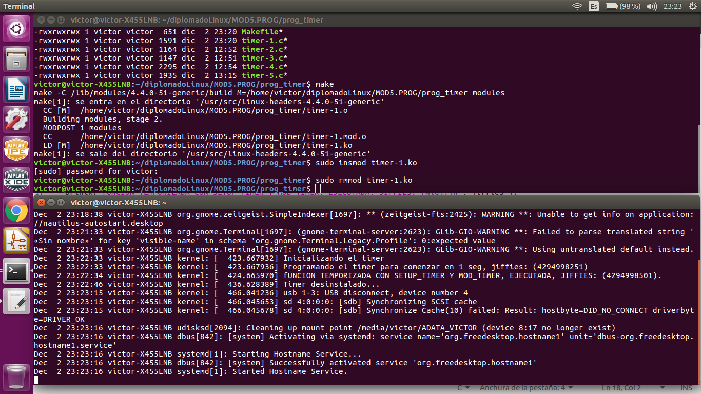
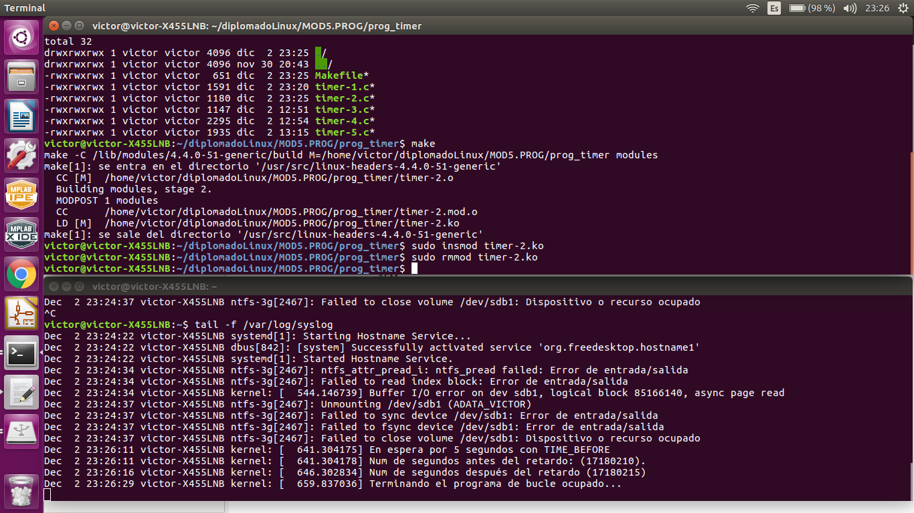
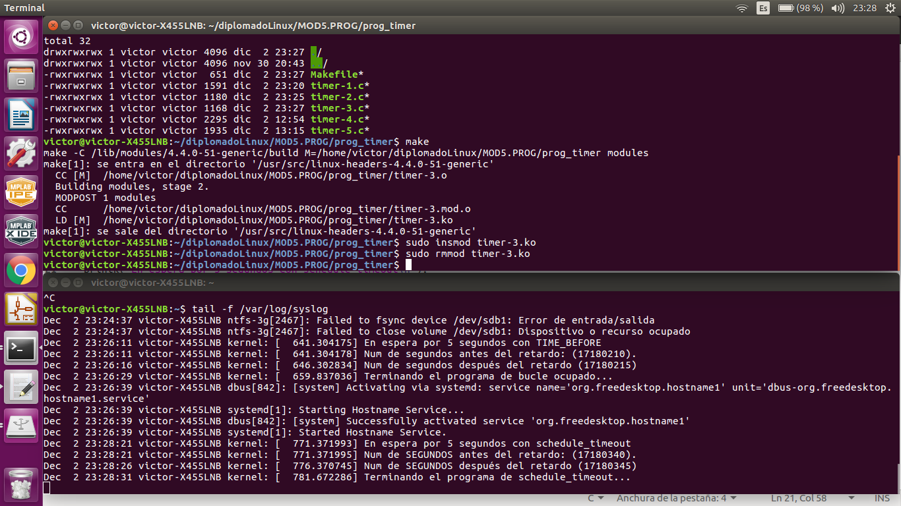
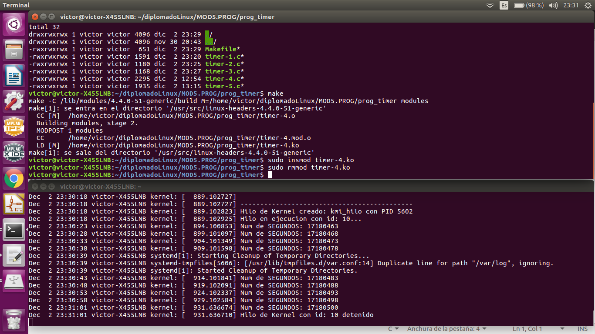

# Tarea 4: TIMER

## Programas de timer
Se realizaron 4 programas: 

1. Timer-1.c
Este programa usa *SETUP_TIMER Y MOD_TIMER*

En la siguiente imagen: Se muestra la creación del módulo, así como la inserción y
el retiro del kernel. Se muestran los mensajes registrados en el archivo /var/log/syslog
cuando se inserta y se retira el timer..

2. Timer-2.c
Este programa usa *TIMER_BEFORE*

En la siguiente imagen: Se muestra la creación del módulo, así como la inserción y
el retiro del kernel. Se muestran los mensajes registrados en el archivo /var/log/syslog
cuando se inserta y se retira el timer..

3. Timer-3.c
Este programa usa *SCHEDULE_TIMEOUT*

En la siguiente imagen: Se muestra la creación del módulo, así como la inserción y
el retiro del kernel. Se muestran los mensajes registrados en el archivo /var/log/syslog
cuando se inserta y se retira el timer..

3. Timer-4.c
Este programa usa *UN HILO DE KERNEL Y SCHEDULE_TIMEOUT*

En la siguiente imagen: Se muestra la creación del módulo, así como la inserción y
el retiro del kernel. Se muestran los mensajes registrados en el archivo /var/log/syslog
cuando se inserta y se retira el timer..

Para realizar este código se tomó como referencias los siguientes enlaces:
[Kernel APIs, Part 3: Timers and lists in the 2.6 kernel](https://www.ibm.com/developerworks/library/l-timers-list/)
 
y los libros:
**_Robert Love. Linux Kernel Development_**

